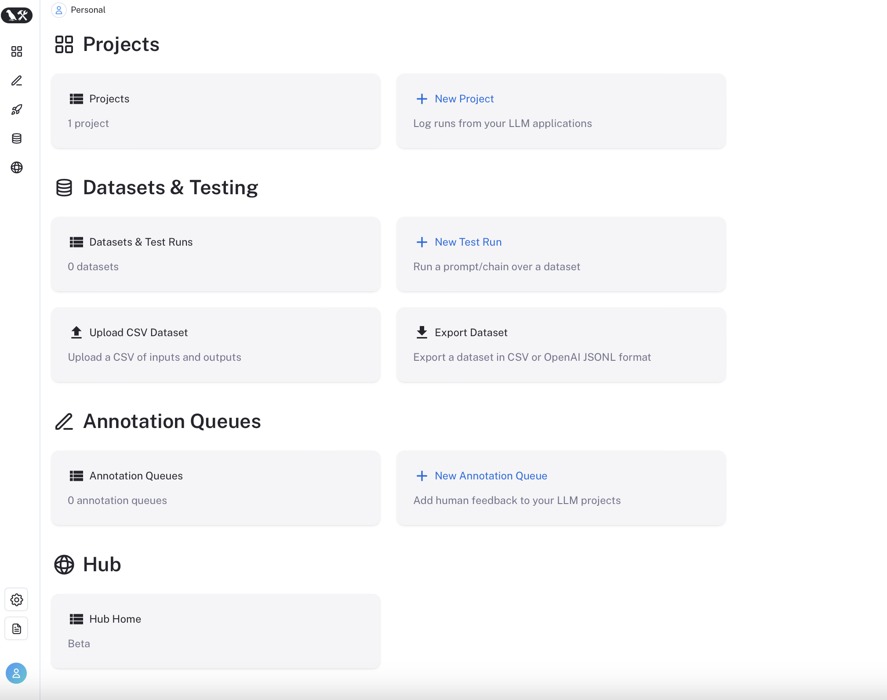
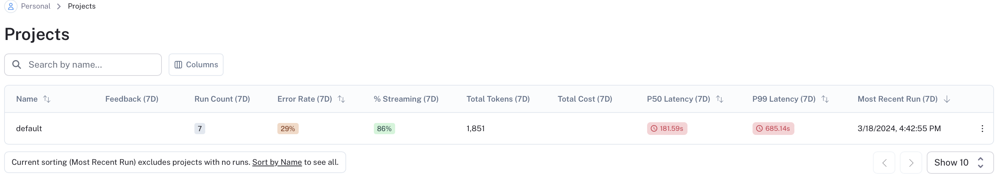
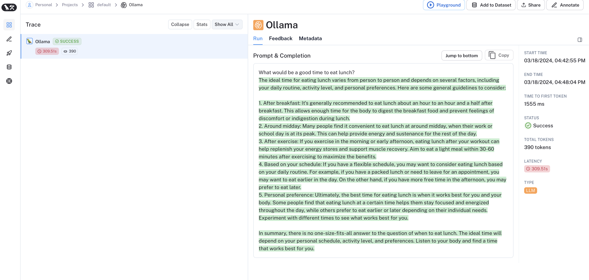
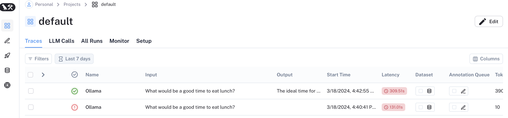

Since I first getting into LLM integrated within App development, I've been mainly using logger for tracing (e.g. to keep track of module processed logs) and debugging. More recently, I tried looking into platforms that might make LLM code development more seamless. [LangSmith](https://www.langchain.com/langsmith) was the first brought to my attention as I've been using Langchain in most of my usecases. LangSmith is developed as a Platform to support DevOps by Langchain. We can look for detail capabilities of LangSmith [here](https://docs.smith.langchain.com), but at high-level, it offers tracing,  evaluation, and prompt management for LangChain (I've tried and will give an example below) or other LLM framework (**To be tried**).

Below, I'd document some notes how to get started with LangSmith.


#### Pre-requisite and setup
- Steps by steps guide can be found [here](https://docs.smith.langchain.com/setup). 

- For personal use, I setup a LangSmith account linking to my github account. After that, we'd see the following screen. LangSmith's pricing model for non-personal account can be found [here](https://docs.smith.langchain.com/pricing).
  
- I then created my LangSmith API keys elect "Settings". Use this API key for the env variable `LANGCHAIN_API_KEY`.


#### If you're using Langchain
- No additional specification is needed once the environment variable is all set. For example, if running the below Langchain example: 

```{python}
from langchain_community.llms import Ollama
from langchain_community.chat_models import ChatOllama
from langchain_core.messages import HumanMessage

llm = Ollama(model="llama2")
chat_model = ChatOllama()

text = "What would be a good time to eat lunch?"
messages = [HumanMessage(content=text)]

print(llm.invoke(text))
```
- We'd found the running under the default project if without specifying: 

- And We'd be able to see this execution logged on LangSmith. This supports us keep track of the input, output, latency, number of tokens, cost and more. 

- Multiple executions under the same project can be tracked, which can used as a dashboard to support debugging for data scientists.


- More "how-tos" can be found [here](https://docs.smith.langchain.com/tracing/faq).